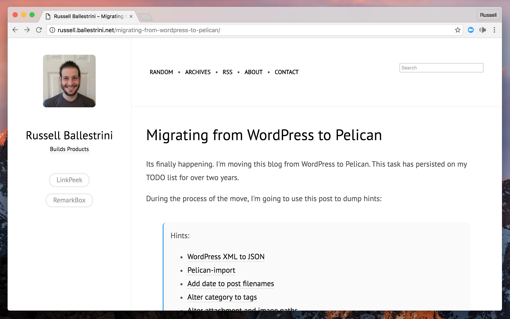

# SVBHACK (forked version by @laughk)

responsive theme for [Pelican](http://getpelican.com), it is my hack of a [gfidente/pelican-svbhack](https://github.com/gfidente/pelican-svbhack) theme.

## Screenshot

## INSTALL

Clone the [repository](https://github.com/laughk/pelican-svbhack), edit your `pelicanconf.py` and modify the `THEME` variable to make it point to the downloaded theme location.

## PELICANCONF.PY

Supports a number of common global variables but patches are welcomed if you need better support.

- `GOOGLE_ANALYTICS` to use Google Analytics, set this var to your UA-XYZ code

- `USER_LOGO_URL` to replace the logo placeholder, put your logo in content/images/your_logo.png and make this var point to `SITEURL + '/static/images/your_logo.png'`

- `DISQUS_SITENAME` set this to your Disqus sitename to enable disqus comments in articles

- `TAGLINE` some text rendered right below the logo

and so on. (sorry coming soon)

When developing locally, you may want to set the following variable: `SITEURL = http://localhost:8000`

## MODIFICATIONS

- Accent color can be changed by editing `@accent` in `./static/css/style.less`.
- A different Pygmentize theme can be used by editing `./Makefile` and running `make pygments`.

## AUTHOR

Kei Iwasaki.

## LICENSE

Released under MIT License, full details in `LICENSE` file.
